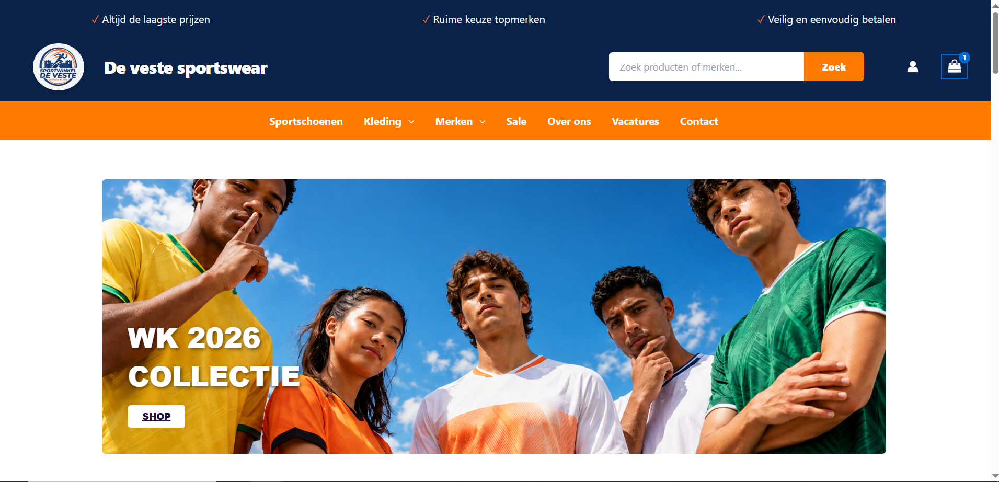
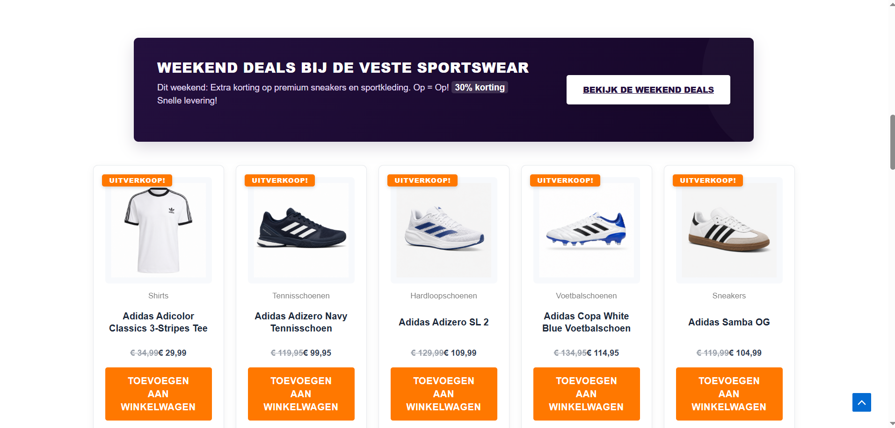
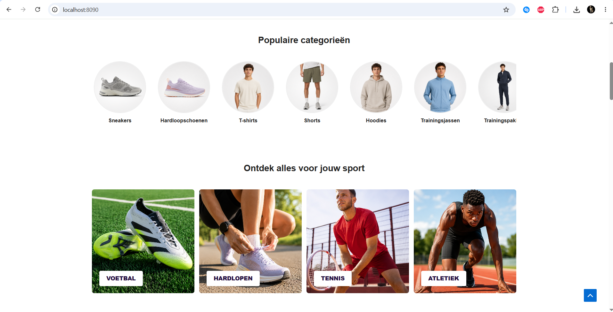
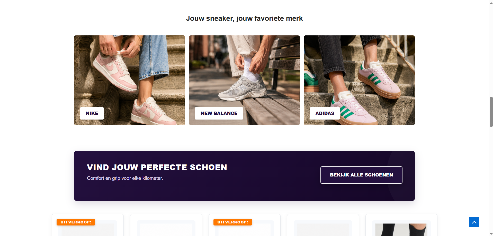
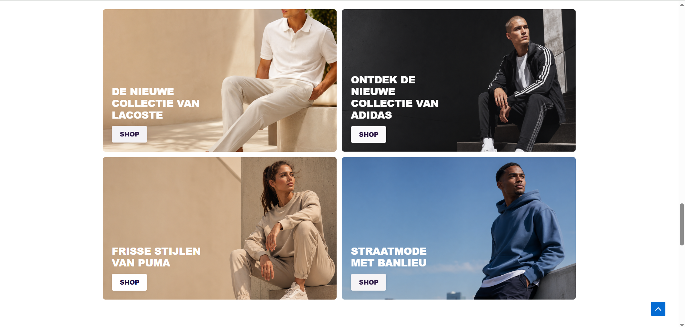
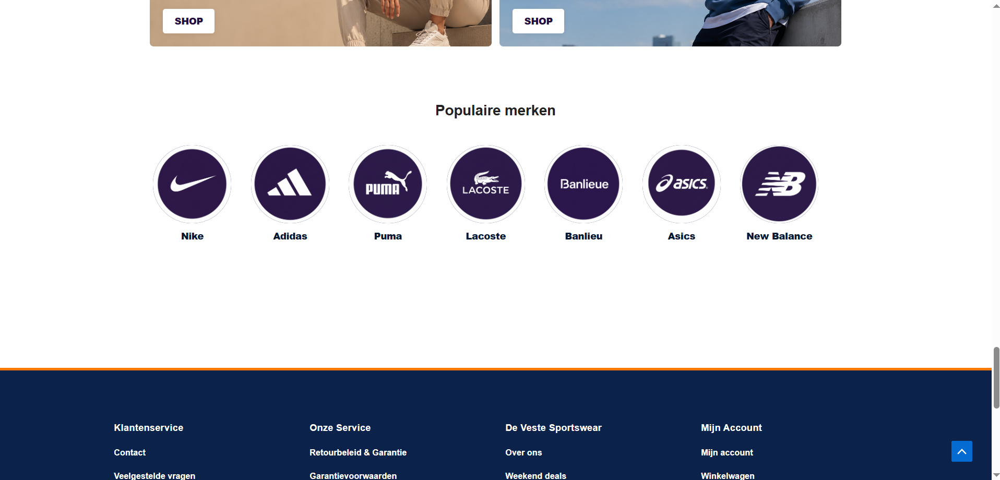
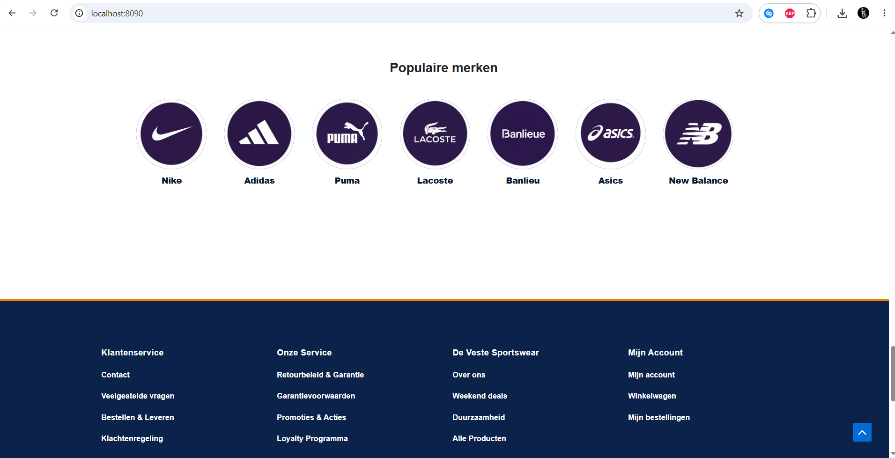
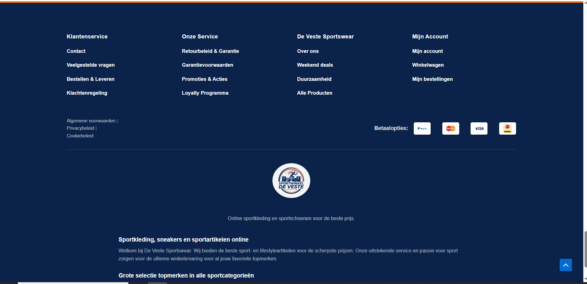
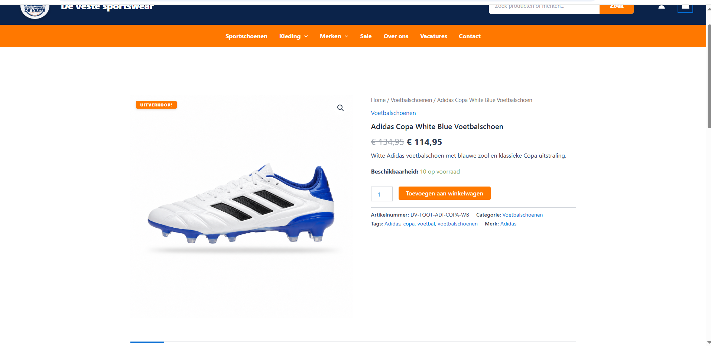
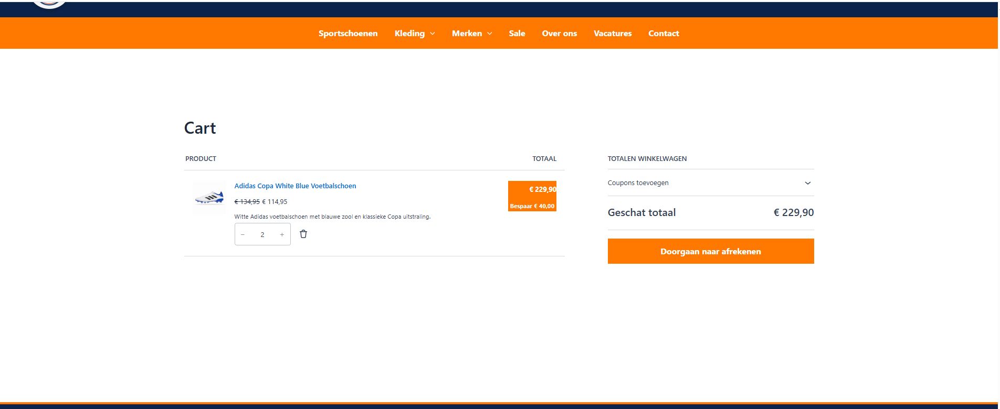

# De Veste Sportswear

A school project: a complete WooCommerce webshop for a fictional sportswear
brand based in Leiden. Built with a custom homepage, category carousels,
legal pages, and GDPR/cookie consent — all in Dutch.

## Stack
- WordPress + WooCommerce
- Astra theme with custom CSS
- Docker (docker-compose)
- Complianz for GDPR/cookie consent

## Features
- Custom homepage modeled on a real sportswear retailer, with hero banner,
  category carousels, sport grids, brand banners, and product shortcodes
- WooCommerce product and category pages across six brands
- Clickable brand banners
- Legal pages (terms, cookie policy, privacy policy, returns, vacancies)
  built as styled custom HTML blocks
- GDPR/cookie consent via Complianz

## Run locally
1. Clone the repo
2. Copy `.env.example` to `.env` and fill in your own values
3. `docker-compose up -d`
4. Visit `localhost:8090`
5. Install WordPress + WooCommerce + the Astra theme, then re-apply the
   custom CSS from `Appearance → Customize → Additional CSS`

## Screenshots

### Homepage

### Product page

### Cart

